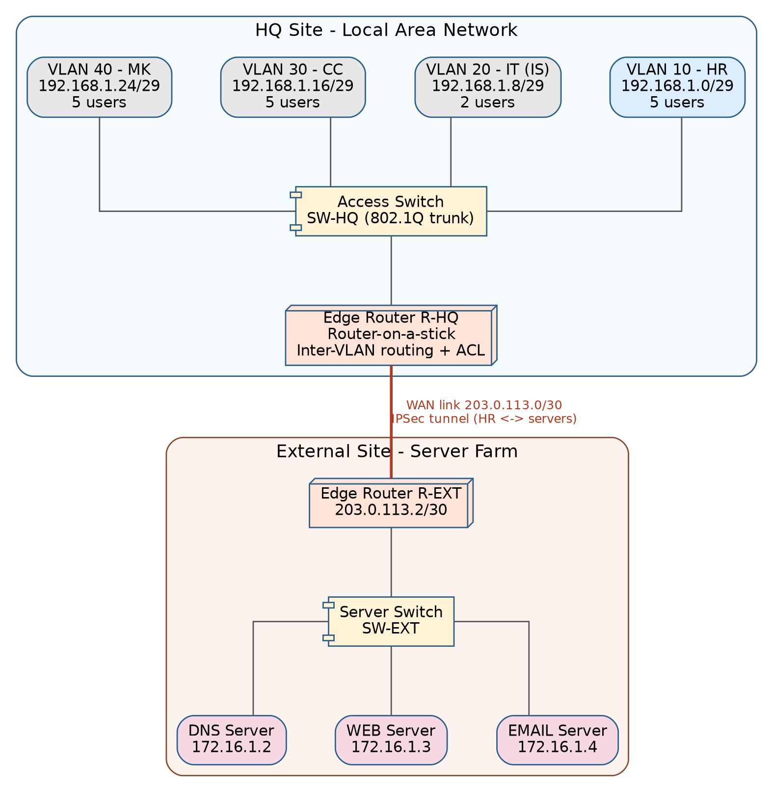
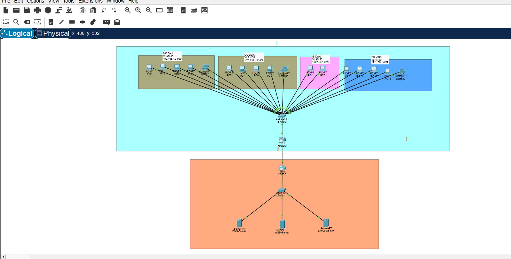
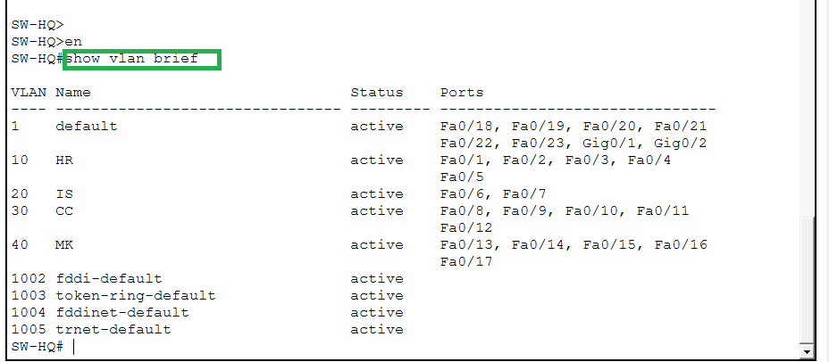
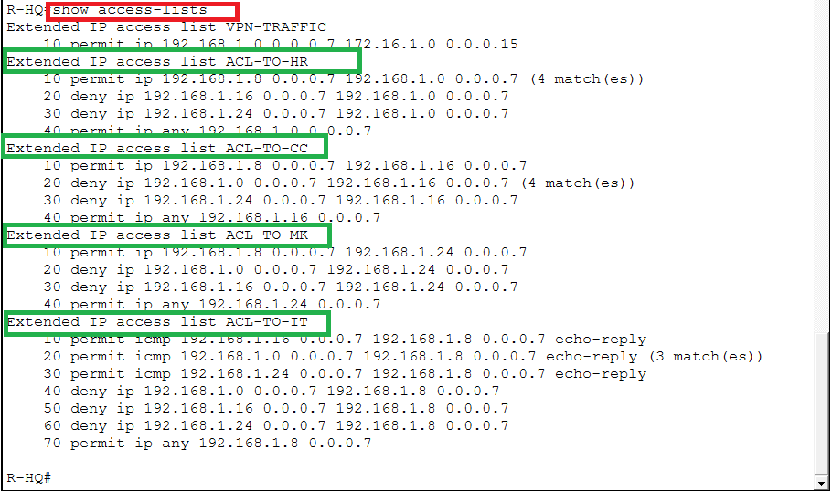
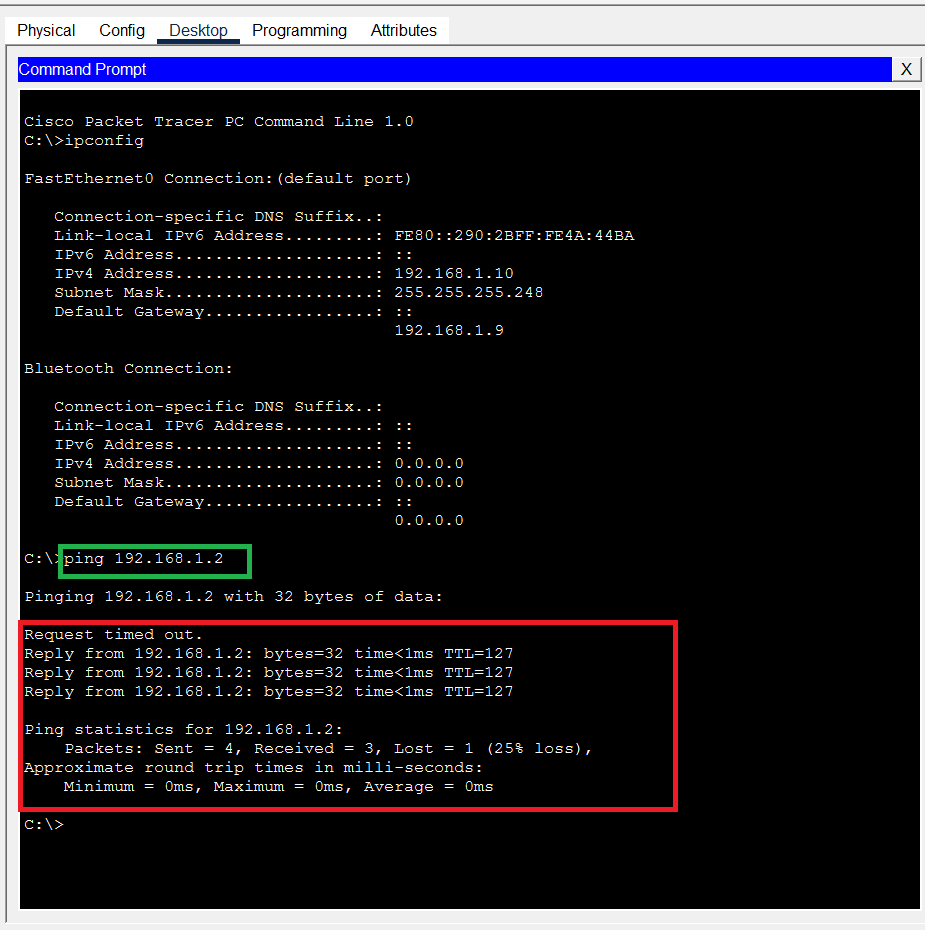
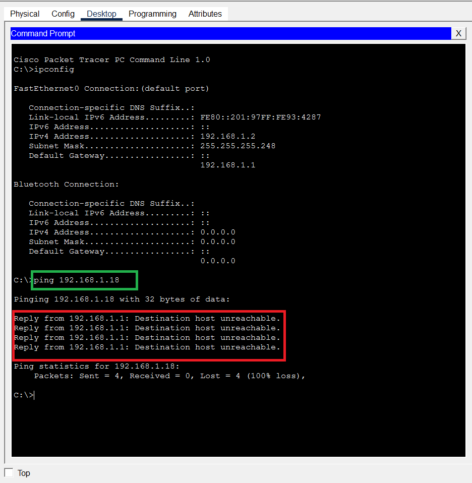
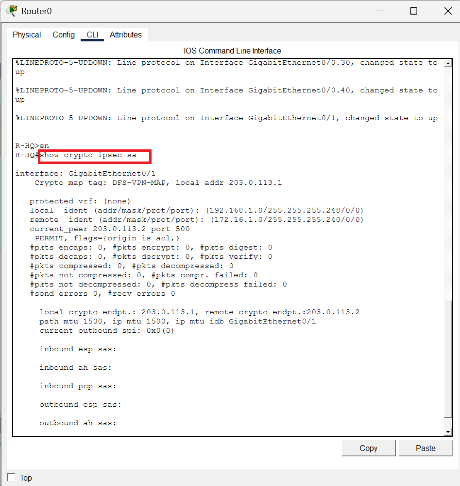

# DFS Network Infrastructure and Security Design

A Cisco Packet Tracer project implementing a segmented LAN, WAN link and externally hosted server site for **Digital Finance Services (DFS)**, a small finance service provider. The build includes VLAN-based department segmentation, Access Control Lists, and a site-to-site IPSec VPN — all configured and verified in Packet Tracer.

## Project brief

DFS is moving from a third-party managed IT model to owning its own network. Requirements:

* Four departments — **HR**, **IT (IS)**, **CC**, **MK** — each on a separate network segment within the same LAN
* HR, CC and MK each have 5 users; IT has 2 users
* **IT must be able to ping/reach every user on the LAN**
* **HR, CC and MK must not be able to reach one another**
* DNS, WEB and EMAIL servers are hosted at an **external site**, reachable only via the WAN link — no servers on the local LAN
* A dedicated **IPSec tunnel** secures communication specifically between **HR and the external site**
* **Access Control Lists** provide further security control

## Network topology



The design follows Cisco's hierarchical internetworking model, collapsed into two tiers appropriate for this scale (17 LAN users across 4 VLANs):

* **Access layer** — `SW-HQ` provides one VLAN per department
* **Distribution/Core (collapsed)** — a single router, `R-HQ`, performs inter-VLAN routing, applies ACLs, and terminates the WAN link
* **WAN edge** — `R-HQ` connects to the external site's router, `R-EXT`, which hosts DNS, WEB and EMAIL behind its own switch, `SW-EXT`

## IP addressing (VLSM)

|VLAN|Department|Network|Usable range|Gateway|
|-|-|-|-|-|
|10|HR|192.168.1.0/29|.1 – .6|192.168.1.1|
|20|IT (IS)|192.168.1.8/29|.9 – .14|192.168.1.9|
|30|CC|192.168.1.16/29|.17 – .22|192.168.1.17|
|40|MK|192.168.1.24/29|.25 – .30|192.168.1.25|

|Segment|Network|Addresses|
|-|-|-|
|WAN transit link|203.0.113.0/30|R-HQ: .1 / R-EXT: .2|
|External server LAN|172.16.1.0/28|Gateway .1, DNS .2, WEB .3, EMAIL .4|

## Repo structure

```
.
├── README.md               this file
├── docs/
│   └── topology.png         network topology diagram
└── configs/
    ├── SW-HQ.txt             HQ access switch — VLANs, access ports, trunk
    ├── R-HQ.txt              HQ router — inter-VLAN routing, ACLs, IPSec
    ├── R-EXT.txt             External site router — WAN, server LAN, IPSec
    └── SW-EXT.txt            External site switch — server ports
```

Each file in `configs/` is the full, working Cisco IOS configuration for that device, in the order it was applied.

## Build steps

### 1\. Enable the security license (R-HQ and R-EXT)

The 2911 routers ship with only the `ipbasek9` package by default. IPSec's `crypto` commands belong to the `security` package, which must be explicitly licensed before those commands are accepted.

```
configure terminal
license boot module c2900 technology-package securityk9
! accept the EULA prompt: yes
end
copy running-config startup-config
reload
! at "Proceed with reload? \\\\\\\\\\\\\\\\\\\\\\\\\\\\\\\\\\\\\\\\\\\\\\\\\\\\\\\\\\\\\\\[confirm]" press Enter only
```

Verify with `show version` — the `security` row must read `securityk9` under **Current** (an Evaluation license is sufficient for a lab build).

### 2\. Configure VLANs and access ports — `SW-HQ`

Each department gets its own VLAN and a block of access ports; all four VLANs are trunked to `R-HQ` for inter-VLAN routing. See [`configs/SW-HQ.txt`](configs/SW-HQ.txt).

Verify with `show vlan brief` (port-to-VLAN assignment) and `show interfaces trunk` (confirms the trunk is actually carrying all four VLANs — see the troubleshooting log below for why this matters).

### 3\. Configure inter-VLAN routing — `R-HQ`

Router-on-a-stick: one physical interface (`Gi0/0`) is split into four sub-interfaces, one per VLAN, each holding that VLAN's gateway address. `Gi0/1` is the WAN-facing interface to `R-EXT`. See [`configs/R-HQ.txt`](configs/R-HQ.txt).

### 4\. Configure the external site router — `R-EXT`

`Gi0/1` mirrors R-HQ's WAN interface; `Gi0/0` is the gateway for the server segment. A static route sends HQ-bound return traffic back across the WAN link. See [`configs/R-EXT.txt`](configs/R-EXT.txt).

### 5\. Configure the server switch and servers — `SW-EXT`

A flat access segment — the three servers don't need VLAN separation from each other, only from the rest of the network (already handled by sitting on their own subnet behind `R-EXT`). See [`configs/SW-EXT.txt`](configs/SW-EXT.txt).

Each server is assigned a static IP (`.2`/`.3`/`.4` on `172.16.1.0/28`, gateway `172.16.1.1`) with its relevant service (DNS / HTTP / SMTP+POP3) enabled under the server's Services tab.

### 6\. Departmental isolation ACLs — `R-HQ`

Three ACLs, each applied **outbound** on the sub-interface they protect: IT is explicitly permitted in, the two peer departments are explicitly denied, and a final `permit ip any` allows everything else (replies, IT traffic, external responses) through.

```
ip access-list extended ACL-TO-HR
 permit ip 192.168.1.8 0.0.0.7 192.168.1.0 0.0.0.7
 deny   ip 192.168.1.16 0.0.0.7 192.168.1.0 0.0.0.7
 deny   ip 192.168.1.24 0.0.0.7 192.168.1.0 0.0.0.7
 permit ip any 192.168.1.0 0.0.0.7
```

*(CC and MK versions follow the same pattern — see* [*`configs/R-HQ.txt`*](configs/R-HQ.txt) *for the full set.)*

### 7\. IT isolation ACL — `R-HQ`

Blocks HR/CC/MK from **initiating** traffic to IT, while still letting IT's own outbound pings receive replies. This needs `echo-reply` explicitly permitted *above* the denies — a blanket deny also catches the reply packets answering IT's own pings, since a reply's source is HR/CC/MK and destination is IT, identical to an unsolicited request.

```
ip access-list extended ACL-TO-IT
 permit icmp 192.168.1.0 0.0.0.7 192.168.1.8 0.0.0.7 echo-reply
 permit icmp 192.168.1.16 0.0.0.7 192.168.1.8 0.0.0.7 echo-reply
 permit icmp 192.168.1.24 0.0.0.7 192.168.1.8 0.0.0.7 echo-reply
 deny   ip 192.168.1.0 0.0.0.7 192.168.1.8 0.0.0.7
 deny   ip 192.168.1.16 0.0.0.7 192.168.1.8 0.0.0.7
 deny   ip 192.168.1.24 0.0.0.7 192.168.1.8 0.0.0.7
 permit ip any 192.168.1.8 0.0.0.7
```

### 8\. IPSec site-to-site VPN — HR only

A crypto ACL (`VPN-TRAFFIC`) scopes the tunnel to **HR-to-server traffic only** — CC, MK and IT can still reach the servers, just not through the encrypted tunnel.

```
ip access-list extended VPN-TRAFFIC
 permit ip 192.168.1.0 0.0.0.7 172.16.1.0 0.0.0.15

crypto isakmp policy 10
 encryption aes 256
 hash sha
 authentication pre-share
 group 2
 lifetime 86400
crypto isakmp key DFS-VPN-Key2026 address 203.0.113.2

crypto ipsec transform-set DFS-TSET esp-aes 256 esp-sha-hmac

crypto map DFS-VPN-MAP 10 ipsec-isakmp
 set peer 203.0.113.2
 set transform-set DFS-TSET
 match address VPN-TRAFFIC

interface gigabitEthernet 0/1
 crypto map DFS-VPN-MAP
```

Mirrored on `R-EXT` with peer/traffic direction reversed — see [`configs/R-EXT.txt`](configs/R-EXT.txt).

> \\\\\\\\\\\\\\\\\\\\\\\\\\\\\\\\\\\\\\\\\\\\\\\\\\\\\\\\\\\\\\\*\\\\\\\\\\\\\\\\\\\\\\\\\\\\\\\\\\\\\\\\\\\\\\\\\\\\\\\\\\\\\\\*Note:\\\\\\\\\\\\\\\\\\\\\\\\\\\\\\\\\\\\\\\\\\\\\\\\\\\\\\\\\\\\\\\*\\\\\\\\\\\\\\\\\\\\\\\\\\\\\\\\\\\\\\\\\\\\\\\\\\\\\\\\\\\\\\\* `hash sha` and `group 2` are used instead of the originally planned `sha256`/`group 14`, because this Packet Tracer IOS image (`15.1(4)M4`) rejects the newer options with "Invalid input detected". AES-256 encryption was retained as planned. Both routers' ISAKMP policies must match exactly for Phase 1 to negotiate.

## Verification commands

|Command|Purpose|
|-|-|
|`show ip interface brief`|Confirms each interface's IP and whether it's up/up|
|`show vlan brief`|Confirms VLAN-to-port assignment on a switch|
|`show interfaces status`|Live per-port link state, VLAN, duplex, speed|
|`show interfaces trunk`|Which VLANs are allowed **and actively forwarding** on a trunk|
|`show spanning-tree vlan <id>`|Per-port STP state (FWD/LIS/LRN/BLK) for a VLAN|
|`show access-lists` / `show ip access-lists`|ACL entries with live match counters|
|`show crypto isakmp sa`|IPSec Phase 1 status (`QM\\\\\\\\\\\\\\\\\\\\\\\\\\\\\\\\\\\\\\\\\\\\\\\\\\\\\\\\\\\\\\\_IDLE` = healthy)|
|`show crypto ipsec sa`|IPSec Phase 2 — encrypt/decrypt packet counters, tunnel scope|

## Screenshots

### Network Topology




### VLAN Configuration




### ACL Match Counters




### Departmental Isolation Test

IT successfully pings HR:




HR fails to ping CC (isolation working):




### IPSec Tunnel Verification




## Test results

|Test|Expected|Result|
|-|-|-|
|IT ping HR / CC / MK hosts|Success|✅ Confirmed|
|HR ping CC / MK|Fail|✅ Confirmed|
|CC ping HR / MK|Fail|✅ Confirmed|
|MK ping HR / CC|Fail|✅ Confirmed|
|HR / CC / MK ping IT (unsolicited)|Fail|✅ Confirmed|
|IT's own outbound pings to HR/CC/MK receive replies|Success|✅ Confirmed|
|HR ping DNS / WEB / EMAIL servers|Success|✅ Confirmed|
|`show crypto isakmp sa` shows `QM\\\\\\\\\\\\\\\\\\\\\\\\\\\\\\\\\\\\\\\\\\\\\\\\\\\\\\\\\\\\\\\_IDLE`|Tunnel Phase 1 active|✅ Confirmed|
|`show crypto ipsec sa` encaps/decaps increase on HR-to-server traffic|Tunnel encrypting HR traffic|✅ Confirmed (17 encaps / 12 decaps observed)|
|CC/MK traffic to servers does not increment IPSec counters|Tunnel scoped to HR only|⬜ Pending final confirmation|

## Troubleshooting log

Real issues hit during the build, root cause, and the fix applied.

|Symptom|Root cause|Fix|
|-|-|-|
|`crypto isakmp` commands rejected — "Invalid input"|`security` technology package not licensed|`license boot module c2900 technology-package securityk9`, then reload|
|`hash sha256` / `group 14` rejected|IOS image doesn't support SHA-256 or DH group 14|Used `hash sha` and `group 2` instead, matched on both routers|
|WAN link shown down; `Gi0/1` status up, protocol down|`R-EXT` interfaces had no IP address and were still shut down|Assigned IPs and applied `no shutdown` on `R-EXT` `Gi0/0` and `Gi0/1`|
|IT reaches CC's gateway but not individual CC hosts|VLAN 30 missing from `SW-HQ`'s trunk allowed-VLAN list|`switchport trunk allowed vlan 10,20,30,40` on `Fa0/24`|
|VLAN 30 allowed on trunk but not yet forwarding|Normal STP reconvergence delay after the trunk change|Waited \~30–50s for STP to reach `FWD` state|
|ACL sequence number reused, second line rejected|Same manual sequence number entered twice|`no 1` to remove the bad entry, re-added with new sequence numbers|
|After `ACL-TO-IT`, IT could no longer ping HR/CC/MK|Deny rules also blocked ICMP echo-reply packets returning to IT|Added explicit `permit icmp ... echo-reply` lines above the denies|
|HR couldn't ping servers despite tunnel showing `QM\\\\\\\\\\\\\\\\\\\\\\\\\\\\\\\\\\\\\\\\\\\\\\\\\\\\\\\\\\\\\\\_IDLE`|DNS/WEB/EMAIL servers had never been assigned IP addresses|Assigned static IP/gateway to each server|

## Tools

* Cisco Packet Tracer
* Devices: 2× Cisco 2911 routers, 2× Cisco 2960 switches, 3× Server-PT, 17× PC/Laptop end devices

## License

This project was built for educational purposes as part of a network security coursework assignment.

